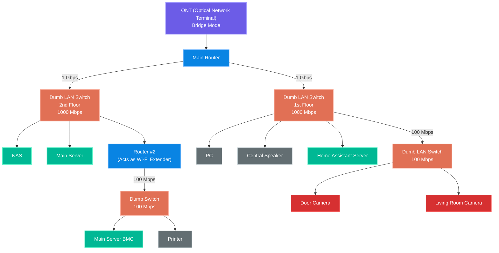

## About My Network Setup...

So... Yeah I admit it. My home network is WEIRD, partly because I'm literally 16 years old, partly because I'm broke. But also it's weird in a good way (kinda), the network is sort of like an intricate web that connects all my important devices together, and that delicacy is held together by LAN cables that are either under the carpet or on the floor , which, if you think about it, is a terrible choice for a sysadmin.

## Diagrams... Fun!

But anyways, lets get to the actual structure of my LAN network by showing you this mermaid diagram:

And I can pretty much say that this setup works great! (though there is a bit of a spaghetti cable situation that needs action)

## Thoughts on switches

I initially thought those dumb and cheap VLAN switches would SERIOUSLY decapacitate my network's speed, but it turns out they remained basically the same 1gbps throughput up AND down, which is surprising considering these switches (5 port, 4 port usable), are around 70 CNY (10.37 USD) a piece.

So I began wondering how this works, then I found it: cheap VLAN switches don’t lose much speed because packet forwarding is handled by dedicated switching hardware, not a slow general-purpose CPU. VLAN tagging adds only a tiny amount of extra data, and modern switch chips can process it at full line rate. The real bottleneck is usually the Ethernet port itself, so thats why I lost no speed!

Now THAT'S what I call a bang for the buck.

# Self-hosted services I am running...

### Main Server Services:

NGINX - Load balancer and webserver in front of my website backend

Grafana - Server/Website traffic Monitoring

Immich - Photo gallery

Jellyfin - Media indexer & Player

Scriberr - Audio/Video transcription (Speech-To-Text)

VaultWarden - Password Manager

Frigate - Cameras & NVR

CarbonPanel - Custom built real-time server monitoring panel

MCSManager - Manager for my minecraft server

## Thinkpad E450 Services (Yes its a repurposed old laptop lol, still works great.)

Home Assistant - Home Controls & Monitoring

  

Right that's about it for this blog, thanks again for reading to the very end and see ya next time!
